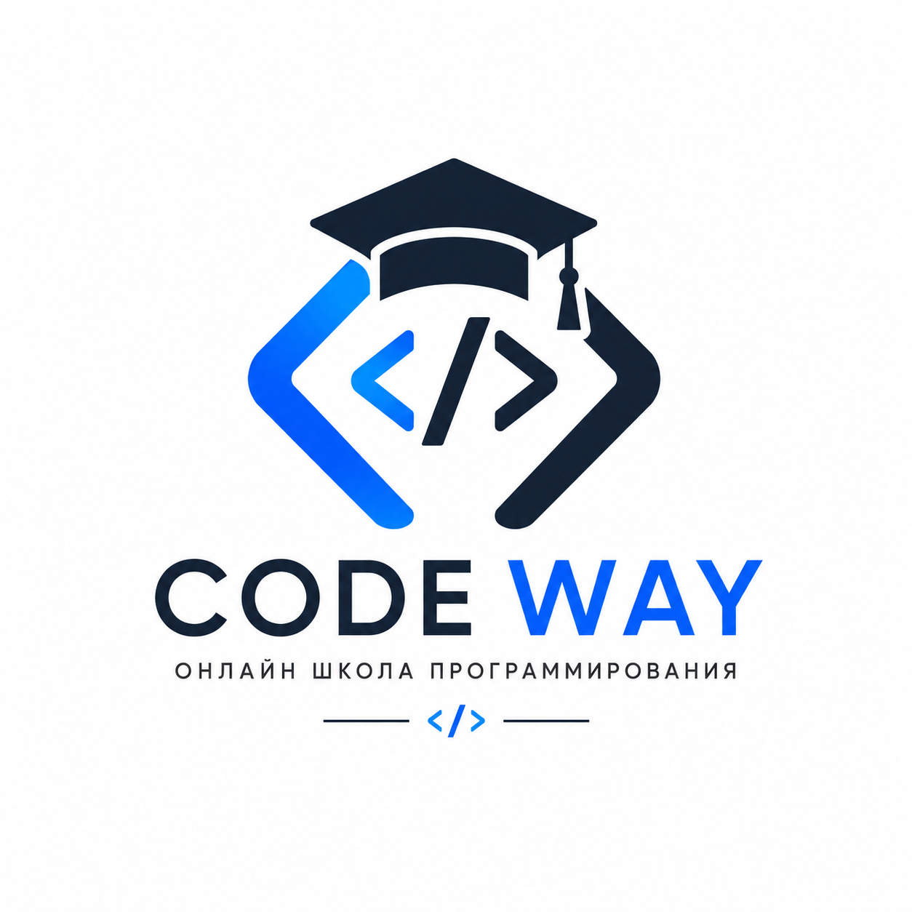

# CODE WAY — онлайн школа программирования

<p align="center"></p>

Платформа для обучения программированию: теория с практикой прямо в браузере (IDE, терминал, SQL-консоль), тесты с автопроверкой, домашние задания с проверкой преподавателем, прогресс обучения и именные сертификаты.

**Стек:** Django + Django REST Framework (JWT через djoser), SQLite/PostgreSQL, фронтенд — адаптивный SPA на чистом HTML/CSS/JS без сборки (дизайн-система построена по рекомендациям [ui-ux-pro-max](https://github.com/EvgeniyK96/ui-ux-pro-max-skill): стиль Flat Design + Accessible, фирменная палитра логотипа — navy `#16243D` + blue `#2563EB`, шрифт Inter).

---

## Курсы

| Курс | Объём | Тесты | Практика в уроке |
|---|---|---|---|
| Python с нуля | 10 модулей, 52 урока | 9 тестов, проходной 75% | Python IDE (Pyodide) |
| C++ с нуля | 10 модулей, 51 урок | 9 тестов, проходной 75% | — |
| JavaScript с нуля | 10 модулей, 50 уроков | 9 тестов, проходной 75% | JS-песочница |
| Java с нуля | 10 модулей, 51 урок | 9 тестов, проходной 75% | — |
| DevOps с нуля | 10 модулей, 51 урок | 9 тестов, проходной 75% | мини-терминал |
| Мини-курс: Linux | 9 уроков | итоговый тест, 70% | мини-терминал |
| Мини-курс: Git | 7 уроков | итоговый тест, 70% | мини-терминал |
| Мини-курс: Docker | 7 уроков | итоговый тест, 70% | мини-терминал |
| Мини-курс: SQL | 8 уроков | итоговый тест, 70% | SQL-консоль |

Контент курсов лежит в `lessons/` в markdown-файлах и импортируется командой `import_courses` (уроки, домашние задания, тесты с правильными ответами).

## Возможности

| Функция | Реализация |
|---|---|
| Личный кабинет | Боковое меню с разделами: обзор, мои курсы, сертификаты, тесты, домашние задания, профиль (`/api/users/dashboard/`) |
| Уроки с теорией | Markdown-теория, рендерится на фронтенде собственным парсером (заголовки, списки, таблицы, блоки кода) |
| Практика в уроке | По типу курса (`Course.runner`): **Python IDE** — Pyodide/WebAssembly с поддержкой `input()`; **JS-песочница** — выполнение в браузере с перехватом `console.*`; **мини-терминал** — эмуляция bash + git + docker с виртуальной файловой системой; **SQL-консоль** — настоящая SQLite через sql.js с демо-таблицами. У примеров кода в теории — кнопка «Попробовать» |
| Тесты модулей | В конце каждого модуля тест (проходной 75%, у мини-курсов итоговый тест 70%); следующий модуль закрыт, пока тест не сдан — блокировка проверяется на сервере, а не только в интерфейсе |
| Домашние задания | Отправка текста/файла (валидация типа и размера ≤10 МБ), статусы «на проверке / принято / на доработку», оценка и комментарий преподавателя (проверка — в админке). Файлы отдаются только автору или преподавателю, как вложение |
| Сертификаты | Выдаются автоматически при 100% прохождении курса (все уроки + все тесты + принятые ДЗ); именной диплом с печатью и подписью руководителя школы, печать в PDF, публичная проверка по номеру |
| Прогресс обучения | Прогресс-бары по курсам, отметки пройденных уроков |
| Главная страница | Герой-блок, каталог с обложками курсов, блоки «О школе» и «Наши менторы», соцсети в футере |
| Адаптивность | Бургер-меню на мобильных, перестройка сетки и личного кабинета под планшет/телефон |

## Быстрый старт

```bash
source venv/bin/activate
pip install -r requirements.txt
python manage.py migrate
python manage.py import_courses         # все курсы из lessons/ (можно --only <slug>)
python manage.py createsuperuser        # администратор для админки
python manage.py runserver
```

- Фронтенд: http://127.0.0.1:8000/
- Swagger: http://127.0.0.1:8000/swagger/
- Админка (проверка ДЗ, управление курсами): http://127.0.0.1:8000/admin/

`import_courses` создаёт учётку преподавателя `teacher / teacher12345` (отображается в карточках курсов, имеет доступ в админку). Команду можно запускать повторно — содержимое курсов пересоздаётся из файлов.

## Как устроен процесс обучения

1. Студент регистрируется (`#/register`) и записывается на курс.
2. Читает теорию урока и сразу закрепляет её практикой: код — во встроенной IDE или песочнице, команды — в учебном терминале, запросы — в SQL-консоли. Отмечает урок пройденным — растёт прогресс.
3. В конце модуля сдаёт тест: нужно набрать **минимум 75%** (в мини-курсах — 70%), иначе следующий модуль остаётся закрытым.
4. Отправляет домашние задания; преподаватель проверяет их в админке (статус «Принято» + оценка).
5. Когда пройдены все уроки, сданы все тесты и приняты все ДЗ — автоматически выдаётся сертификат с уникальным номером. Проверка подлинности: `GET /api/certificates/verify/<номер>/`.

## Основные эндпоинты API

| Метод | URL | Описание |
|---|---|---|
| POST | `/api/auth/users/` | Регистрация |
| POST | `/api/auth/jwt/create/` | Вход (JWT) |
| GET/PATCH | `/api/users/me/` | Профиль |
| GET | `/api/users/dashboard/` | Сводка личного кабинета |
| GET | `/api/courses/` | Каталог курсов (`?search=`, `?level=`) |
| GET | `/api/courses/<id>/` | Курс с модулями, уроками и статусом блокировок |
| POST | `/api/courses/<id>/enroll/` | Записаться на курс |
| GET | `/api/courses/lessons/<id>/` | Урок (только для записанных, модуль должен быть открыт) |
| POST | `/api/courses/lessons/<id>/complete/` | Отметить урок пройденным |
| GET | `/api/assessments/quizzes/<id>/` | Тест (без правильных ответов) |
| POST | `/api/assessments/quizzes/<id>/submit/` | Сдать тест `{"answers": {"<question_id>": <choice_id>}}` |
| POST | `/api/assessments/homeworks/<id>/submit/` | Сдать ДЗ (текст и/или файл) |
| GET | `/api/certificates/` | Мои сертификаты |
| GET | `/api/certificates/verify/<номер>/` | Публичная проверка сертификата |

## Структура

```
apps/
├── users/          # профиль, дашборд личного кабинета
├── courses/        # курсы, модули, уроки, записи, прогресс
│   └── management/commands/import_courses.py   # импорт курсов из lessons/
├── assessments/    # тесты, вопросы, попытки, ДЗ; блокировка модулей (services.py)
└── certificates/   # сертификаты + сервис автоматической выдачи (services.py)
core/               # настройки (django-environ), маршруты, JWT, Swagger,
                    # версия статики для сброса кэша (context_processors.py)
lessons/            # markdown-контент курсов (модули, домашки, тесты)
templates/index.html   # оболочка SPA
static/app.js          # роутинг, страницы, markdown-рендер, IDE/терминал/SQL-консоль
static/styles.css      # дизайн-система CODE WAY
```

## Тесты и линт

```bash
pip install -r requirements-dev.txt
pytest
ruff check .
```

## Безопасность

- **Права доступа:** каждый приватный эндпоинт фильтрует по текущему пользователю; уроки и тесты закрытых модулей возвращают 403 на сервере.
- **Загрузка файлов ДЗ:** белый список расширений (без `.php`/`.sh`/`.exe`), лимит 10 МБ; файлы отдаются защищённым вью `submissions/<id>/file/` только автору или персоналу и как `attachment` — stored-XSS через загрузку исключён.
- **Троттлинг:** вход — 10 запросов/мин, регистрация — 5/мин (DRF `ScopedRateThrottle`).
- **Прод-хардненинг:** при `DEBUG=False` включаются secure-cookies, HttpOnly-сессия, nosniff, `X-Frame-Options: DENY`; HTTPS-редирект и HSTS настраиваются через `.env` (см. секцию «Безопасность» в `.env`). `python manage.py check --deploy` проходит без предупреждений.

## Docker

```bash
docker compose up --build   # Django + PostgreSQL, миграции накатываются автоматически
```

## Лицензия

[MIT](LICENSE)
